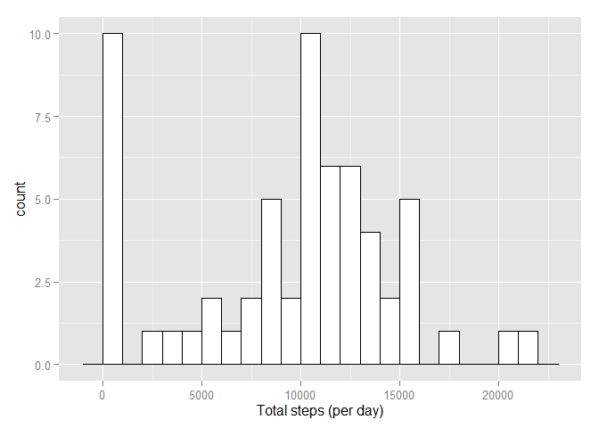
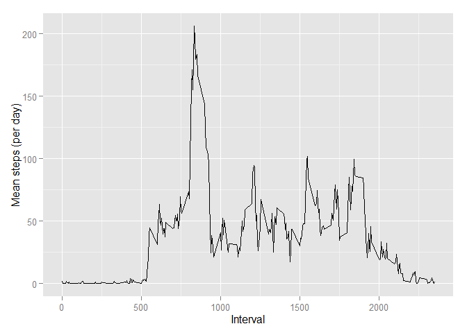
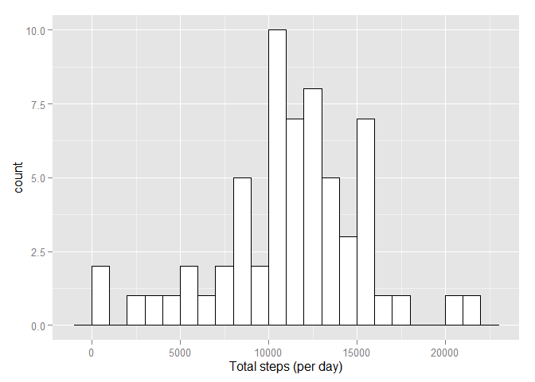
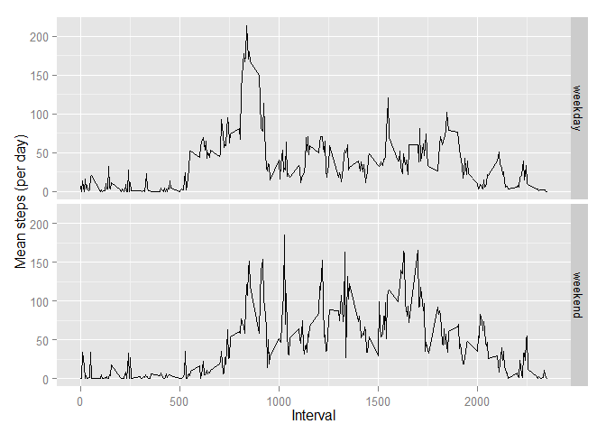

# Reproducible Research: Peer Assessment 1


First, we'll load the necessary pacakges: `dplyr` for data manipulation, `ggplot2` for plotting, and `mice` for imputing missing data.


```r
library("dplyr")
library("ggplot2")
library("mice")
```

## Loading and preprocessing the data

### 1. Load the data.

We read in the CSV file.


```r
activity <- read.csv("activity.csv")
```

### 2. Process/transform the data (if necessary) into a format suitable for your analysis

The data is already tidy (except for missing values) and does not need to be processed or cleaned. The necessary transformations will be performed below in the steps where they apply.

## What is mean total number of steps taken per day?

Using the `summarize` function from the `dplyr` package, we find the total number of steps for each day.


```r
activity_days <- activity %>%
    group_by(date) %>%
    summarize(total_steps = sum(steps, na.rm = TRUE))

head(activity_days)
```

```
## Source: local data frame [6 x 2]
## 
##         date total_steps
## 1 2012-10-01           0
## 2 2012-10-02         126
## 3 2012-10-03       11352
## 4 2012-10-04       12116
## 5 2012-10-05       13294
## 6 2012-10-06       15420
```

### 1. Make a histogram of the total number of steps taken each day


```r
ggplot(activity_days, aes(x = total_steps)) +
    geom_histogram(binwidth = 1000, colour="black", fill="white") +
    xlab("Total steps (per day)")
```

 

### 2. Calculate and report the mean and median total number of steps taken per day.

The mean number of steps taken per day is 9354.2295 and the median number of steps taken per day is 10395.

## What is the average daily activity pattern?

Again, we use `summarize` but this time to calculate the mean over all days for each 5-minute interval.


```r
activity_intervals <- activity %>%
    group_by(interval) %>%
    summarize(mean_steps = mean(steps, na.rm = TRUE))

head(activity_intervals)
```

```
## Source: local data frame [6 x 2]
## 
##   interval mean_steps
## 1        0    1.71698
## 2        5    0.33962
## 3       10    0.13208
## 4       15    0.15094
## 5       20    0.07547
## 6       25    2.09434
```

### 1. Make a time series plot of the 5-minute interval (x-axis) and the average number of steps taken, averaged across all days (y-axis).


```r
ggplot(activity_intervals, aes(x = interval, y = mean_steps)) +
    geom_line() +
    xlab("Interval") +
    ylab("Mean steps (per day)")
```

 

### 2. Which 5-minute interval, on average across all the days in the dataset, contains the maximum number of steps?

The maximum value (206.1698) occurs in the interval labeled 835.

## Imputing missing values

### 1. Calculate and report the total number of missing values in the dataset (i.e. the total number of rows with NAs)

There are 2304 rows (out of 17568) with an `NA`.

### 2. Devise a strategy for filling in all of the missing values in the dataset.

We will use the `mice` package to impute missing values.

### 3. Create a new dataset that is equal to the original dataset but with the missing data filled in.

(This takes a while, so in the R markdown document, we set `cache = TRUE`.)


```r
activity_imp <- mice(activity)
activity_imp <- complete(activity_imp)
```

```r
head(activity_imp)
```

```
##   steps       date interval
## 1     0 2012-10-01        0
## 2     0 2012-10-01        5
## 3    42 2012-10-01       10
## 4     0 2012-10-01       15
## 5   744 2012-10-01       20
## 6    52 2012-10-01       25
```

### 4. Make a histogram of the total number of steps taken each day and calculate and report the mean and median total number of steps taken per day. Do these values differ from the estimates from the first part of the assignment? What is the impact of imputing missing data on the estimates of the total daily number of steps?

The analysis below is identical to the analysis above, except we've replaced the `activity` data frame with `activity_imp`, the one with imputed values.


```r
activity_imp_days <- activity_imp %>%
    group_by(date) %>%
    summarize(total_steps = sum(steps, na.rm = TRUE))

head(activity_imp_days)
```

```
## Source: local data frame [6 x 2]
## 
##         date total_steps
## 1 2012-10-01       15387
## 2 2012-10-02         126
## 3 2012-10-03       11352
## 4 2012-10-04       12116
## 5 2012-10-05       13294
## 6 2012-10-06       15420
```


```r
ggplot(activity_imp_days, aes(x = total_steps)) +
    geom_histogram(binwidth = 1000, colour="black", fill="white") +
    xlab("Total steps (per day)")
```

 

The mean number of steps taken per day is 11195.2787 and the median number of steps taken per day is 11458.

The above values are quite a bit higher than in the original data set. This is because in the earlier analysis, we set `na.rm = TRUE`, which eliminated all measurements from the days full of missing values. This created zeros in `activity_days` and these zeros pulled the mean down. (The median was less affected, but the presence of a number of days at zero moved the median down a little as well.) With imputed data, those totals become non-zero, so the mean---and to some degree the median---also get larger.

## Are there differences in activity patterns between weekdays and weekends?

### 1. Create a new factor variable in the dataset with two levels – “weekday” and “weekend” indicating whether a given date is a weekday or weekend day.

We need to change `date` to be a Date variable. Then we add `weekday` to record the (abbreviated) weekday, and the factor variable `is_weekday` to identify the day as either "weekday" or "weekend".


```r
activity_imp2 <- activity_imp %>%
    mutate(date = as.Date(date),
           weekday = weekdays(date, abbreviate = TRUE),
           is_weekday = as.factor(
               ifelse((weekday %in% c("Mon", "Tue", "Wed", "Thu", "Fri")),                       
               "weekday", "weekend")))

head(activity_imp2)
```

```
##   steps       date interval weekday is_weekday
## 1     0 2012-10-01        0     Mon    weekday
## 2     0 2012-10-01        5     Mon    weekday
## 3    42 2012-10-01       10     Mon    weekday
## 4     0 2012-10-01       15     Mon    weekday
## 5   744 2012-10-01       20     Mon    weekday
## 6    52 2012-10-01       25     Mon    weekday
```

### 2. Make a panel plot containing a time series plot of the 5-minute interval (x-axis) and the average number of steps taken, averaged across all weekday days or weekend days (y-axis).

First we need to `summarize` the means across days and grouped by `interval` and `is_weekday`.


```r
activity_imp_intervals <- activity_imp2 %>%
    group_by(interval, is_weekday) %>%
    summarize(mean_steps = mean(steps, na.rm = TRUE))

head(activity_imp_intervals)
```

```
## Source: local data frame [6 x 3]
## Groups: interval
## 
##   interval is_weekday mean_steps
## 1        0    weekday      7.267
## 2        0    weekend      0.000
## 3        5    weekday      0.400
## 4        5    weekend      0.000
## 5       10    weekday     13.578
## 6       10    weekend     34.312
```

And now, we make the plot.


```r
ggplot(activity_imp_intervals, aes(x = interval, y = mean_steps)) +
    geom_line() +
    facet_grid(is_weekday~.) +
    xlab("Interval") +
    ylab("Mean steps (per day)")
```

 

There seems to be some differences in the average number of steps on weekdays and weekends, especially in the middle of the day.
